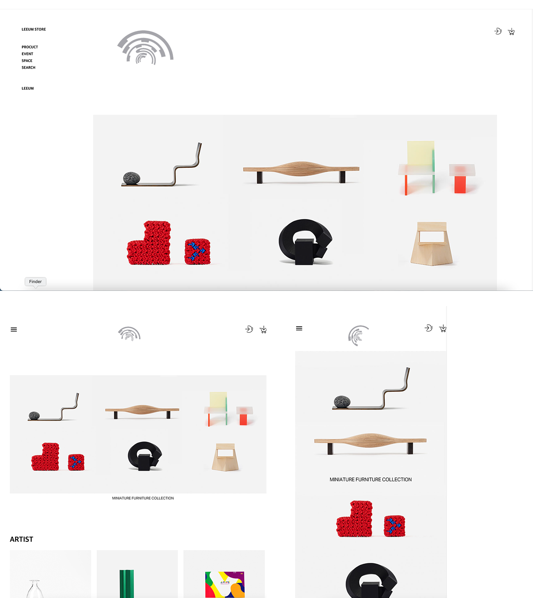

# Leeum store

반응형 연습과 자바스크립트 실습을 위하여 리움스토어 메인 페이지를 클론코딩 하였습니다

 

## 📎 사이트

- 기존 사이트 : http://leeumstore.org/
- 배포 사이트 : https://yxxnhx.github.io/leeum-clone/index

 

## 📅 기간

22.05.26 ~ 22.06.02

 

## 🏹 Skills

- HTML
- CSS
- JavaScript

 

## 🔎 Detail

- 해상도 분기점을 1200px, 768px, 360px으로 데스크탑, 테블릿, 모바일을 잡아 미디어 쿼리를 활용하여 반응형으로 페이지를 구현해내었습니다.
- 또한 좌측의 메뉴는 아코디언 형식으로 각각의 인덱스 번호에 맞게 선택이 되었을 경우 보여질 수 있도록 구현해내었습니다.

 

## 🚀 Result

 

## 📍 Review

처음으로 미디어 쿼리를 이용하여 반응형을 구성해내었으며 자바스크립트를 활용하여 아코디언을 직접 구현해내는 것을 실습해보았습니다.

classList와 index number를 활용하여 아코디언 메뉴를 만들어내니 첫 실습이라 어이없는 실수들도 많았습니다.

이벤트를 추가할 때 어디에 추가를 해야할지 정확하게 감이 오지 않아 더 찾아보고 다시 직접 하나씩 넣어보고 콘솔에 확인을 해보니 이벤트가 일어날 그 요소에 직접 넣지 않고 그 요소를 싸고 있는 대상에게 넣고 그 안에서 e.target으로 어떠한 일들이 일어날 것인지 지정한다는 것을 알게 되었습니다.

리움 스토어에서 flex space-between을 넣어도 양끝정렬이 제대로 이루어지지 않아 확인해보니 html에 서 요소를 수정하고 추가를 하던 과정에서 a태그 닫는 태그가 지워져서 제대로 인식이 되지 않아 생긴 일임을 확인하고 수정하였습니다. 또한 이전에 시도하였던 아코디언 메뉴를 다시 시도하던 중 세진님의 도움을 받아 data 번호에 문제가 생겨 제대로 열리지 않았음을 알게 되었습니다. dep2가 없는 dep1에도 언젠가는 dep2가 생길 수도 있으니 일괄적으로 data 번호를 부여 하였으나 컴퓨터에서는 해당 data 번호와 인덱스 번호가 제대로 맞지 않아 생겼던 문제였었습니다. 필요없는 부분들을 지우고 다시 지정 후 출력을 하니 제대로 아코디언 메뉴가 작동이 됨을 확인하였습니다.
